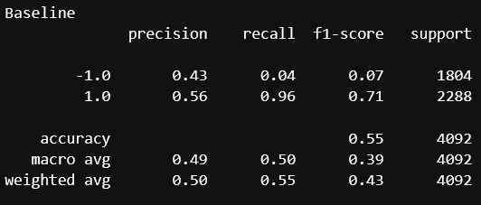

# machine_learning_trading_bot.ipynb

## Background

For this Challenge, you’ll assume the role of a financial advisor at one of the top five financial advisory firms in the world. Your firm constantly competes with the other major firms to manage and automatically trade assets in a highly dynamic environment. In recent years, your firm has heavily profited by using computer algorithms that can buy and sell faster than human traders.

The speed of these transactions gave your firm a competitive advantage early on. But, people still need to specifically program these systems, which limits their ability to adapt to new data. You’re thus planning to improve the existing algorithmic trading systems and maintain the firm’s competitive advantage in the market. To do so, you’ll enhance the existing trading signals with machine learning algorithms that can adapt to new data.

## What You're Creating
You’ll combine your new algorithmic trading skills with your existing skills in financial Python programming and machine learning to create an algorithmic trading bot that learns and adapts to new data and evolving markets.

In a Jupyter notebook, you’ll do the following:

Implement an algorithmic trading strategy that uses machine learning to automate the trade decisions.

Adjust the input parameters to optimize the trading algorithm.

Train a new machine learning model and compare its performance to that of a baseline model.

As part of the README.md file in your GitHub repository, you’ll also create a report that compares the performance of the machine learning models based on the trading predictions that each makes and the resulting cumulative strategy returns.

## Technologies

Pandas, Jupyter Lab, PyVizlot, SciKit Learn, Numpy

## Project analysis and report

## Baseline SVM Model

 

 

 ## SVM DateOffset 4 months ##

  

## SVM DateOffset 6 months ## 

  

## Evaluating the Logistic Regression Classifier

## Q: Did this new model perform better or worse than the provided baseline model? Did this new model perform better or worse than your tuned trading algorithm?

The LogisticRegression classifier was applied to the baseline data and produced the following results:

## Linear Regression Model ## 

  

The accuracy decreased to 52 as a result of this modeling, and although our precision stayed at 56, the recall fell through the floor to 66 in comparison to our baseline of 96, yielding a final return that was less than the Actual Return. Overall, its performance was worser than that of the "tuned" model; nevertheless, testing a variety of SMA windows might have produced better outcomes.

## Q1: What impact resulted from increasing or decreasing the training window?

Adjustment of the model to 6month DateOffSet with the same windows produced a Strategy Retrun of over 1.8. The recall score also improved from 95 to 98.

## Q2: What impact resulted from increasing or decreasing either or both of the SMA windows?

When the SMA window was increased to 50 short and 100 long keeping the baseline 4month DateOffSet, recall increased to 100 whilst accuracy remained at 56. Similar to the 6month DateOffSet the Strategy and Actual returns are the same with a return of just below 1.4

## Q3. The best Strategy Return result tested in the data was a 6mth DateOffSet with the SMA set to 4 short and 100 long as shown below.

## Conclusions ##

When comparing the baseline SVM models, the version with the DateOffset parameter set to 6 months was more exact but still had the same accuracy as the 4 month offset. Compared to the baseline, the 4-month SVM was more accurate but not as exact. Compared to the baseline, the six-month period was more exact and accurate. All things considered, the most useful version of the SVM among those examined is the one with the DateOffset set to six months. The 6-month SVM exhibits greater accuracy when compared to the Linear Regression model. Both models were equally accurate, though. The six-month offset SVM is the model that I would advise using. 
